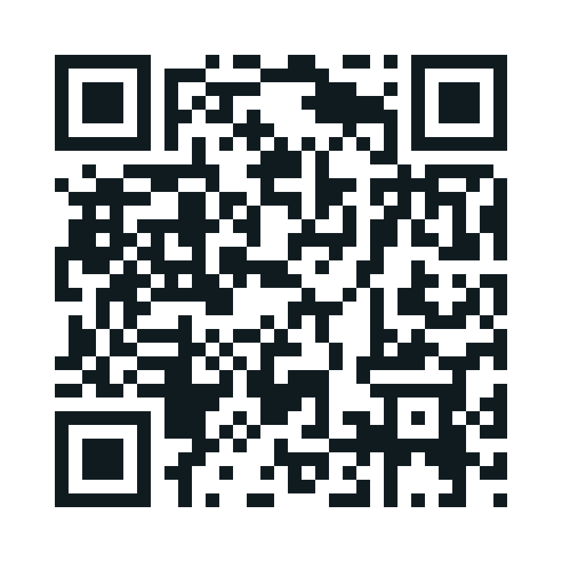
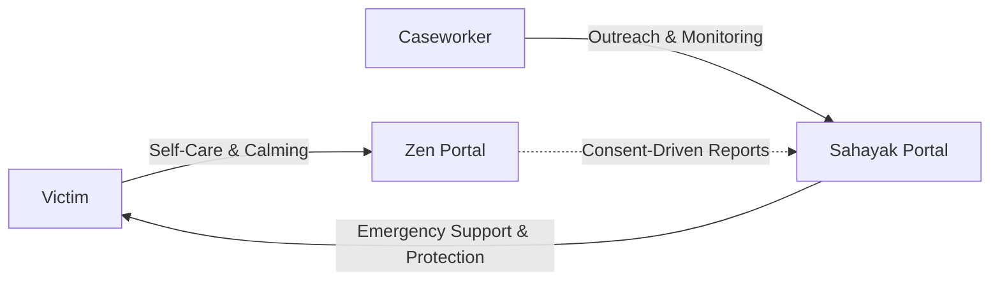

# Zen & Sahayak: Two Portals, One Safety Net

> **Smart India Hackathon (SIH) • Problem Statement 26094**  
> An integrated platform delivering victim psycho-social rehabilitation and proactive caseworker administration.

---

## 🌟 Overview

After an atrocity or trauma, victims require two vital pillars:
1. **A safe, confidential space** to reflect, breathe, de-escalate crisis, and understand their legal protections without fear of exposure.
2. **Institutional accountability and continuous outreach** ensuring caseworkers, protection officers, and administrative authorities actively follow up and never let a case slip through the cracks.

### 🌐 Live Portal Gateway: [shayakandzen.vercel.app](https://shayakandzen.vercel.app/)

  
   
  <em>Scan to open <b>shayakandzen.vercel.app</b> directly on mobile</em>

| Portal | Audience | Live URL | Core Purpose |
|---|---|---|---|
| **Zen** | Victims / Citizens | [zen-2cok.vercel.app](https://zen-2cok.vercel.app/#landing) | Private on-device emotional support, 5 caring AI companions, rights navigator, breathing exercises, and regional language assistance. |
| **Sahayak** | Caseworkers / Officers | [sahayak-portal-mosje.vercel.app](https://sahayak-portal-mosje.vercel.app/) | District triage dashboard, automated voice check-in telemetry (IVR), witness protection alerts, and compliance tracking. |

---

## 🚀 How It Works

1. **Feel Safe:** The victim uses Zen on their personal device for private healing, emotional reframing, and knowing their legal protections.
2. **Stay in Touch:** Sahayak initiates regular, low-friction check-in calls in the victim's mother tongue without requiring Internet or smartphones.
3. **Rapid Help:** When distress is detected or calls go unanswered, caseworkers receive prioritized alerts to deploy protection officers immediately.

---

## 📞 Integrated Helplines

- **Tele-MANAS (Mental Health):** `14416`
- **NALSA (Free Legal Aid):** `15100`
- **National Emergency Number:** `112`

---

## ⚡ Vercel Deployment

This project is fully optimized for zero-configuration deployment on **Vercel**:

1. Fork or push this repository to GitHub.
2. Go to [Vercel Dashboard](https://vercel.com/new).
3. Import `ZEN-X-SAHAYAK`.
4. Click **Deploy** (No custom build command required).
